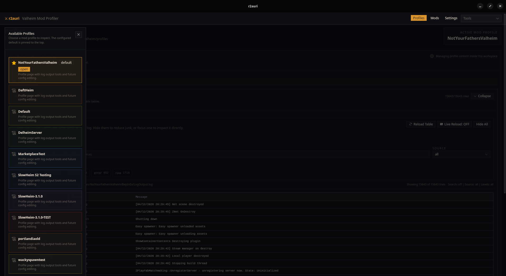

# r2auri

Welcome to r2auri, a desktop Valheim profile inspector and config utility for modded Valheim, built with Tauri + React.

r2auri reads your r2modman Valheim profiles, helps you inspect installed mods and logs, and now includes custom-built tools for editing some live profile config data.



## Warning

r2auri is a work in progress.

This app can read and edit live profile config files inside your Valheim mod profiles.

Use it at your own risk.

Keep backups of any profile or config you care about before using the editing tools.

If a tool writes invalid data, or if a mod reacts badly to changed config values, that is on you to recover from. Back up first.

## Current Features

- Load Valheim profiles from your configured r2modman profiles directory.
- Set and save a default profile.
- Manage app settings, including mods path and smart pattern settings.
- Browse installed mods for a selected profile.
- Map mod config files found under `BepInEx/config`.
- Use a smart log viewer with search, source/level filtering, live tail support, and custom regex-based pattern filters.
- Create and manage custom smart patterns used to classify noisy or important log lines.
- Open custom tools for profile-specific config files when those files are detected.

## Custom Tools

r2auri currently includes custom-built tools for:

- StarLevelSystem: edits `defaultCreatureLevelUpChance` in `BepInEx/config/StarLevelSystem/LevelSettings.yaml`.
- Wacky Custom Spawners: edits `BepInEx/config/WackyMole.CustomSpawners.yml`.

More custom tools are planned.

## What The App Is Right Now

- Primarily a profile viewer, settings manager, log analysis tool, and targeted config editor.
- Not a full general-purpose Valheim mod config editor.
- Not stable enough to assume every config write path is battle-tested.

## Expected Default Path

By default, r2auri reads profiles from:

`~/.config/r2modmanPlus-local/Valheim/profiles`

Each profile is expected to contain a `mods.yml` file.

## How To Use

1. Launch the app.
2. Open `Settings` and confirm the Valheim mods path.
3. Optionally choose a default profile.
4. Open `Profiles` to inspect the active profile, logs, and linked config files.
5. Use the smart log viewer to search, filter, and manage custom regex patterns.
6. If r2auri detects supported config files for the active profile, open the matching tool from the header `Tools` menu.
7. Before saving config edits, make sure you have a backup of the original file.

## Editing Disclaimer

The custom tools edit real files in your profile directory. They are not sandboxed.

Recommended workflow:

1. Back up the profile or target config file.
2. Make a small change.
3. Save.
4. Test in game.
5. If anything looks wrong, restore from backup.

## Build For Linux

These instructions are for Linux (your current platform).

1. Install system dependencies (example for Debian/Ubuntu):

```bash
sudo apt update
sudo apt install -y \
	libwebkit2gtk-4.1-dev \
	libgtk-3-dev \
	libayatana-appindicator3-dev \
	librsvg2-dev \
	patchelf \
	build-essential \
	curl \
	wget \
	file \
	libssl-dev
```

2. Install Rust toolchain (if not already installed):

```bash
curl https://sh.rustup.rs -sSf | sh
source "$HOME/.cargo/env"
```

3. Install Node.js and project dependencies:

```bash
pnpm install
```

4. Run in development mode:

```bash
pnpm tauri dev
```

5. Build a release bundle:

```bash
pnpm tauri build
```

Build output is generated under `src-tauri/target/release/bundle`.

## Status

This project is actively evolving.

Expect rough edges, missing safeguards, and incomplete tool coverage while the custom tool system expands.
